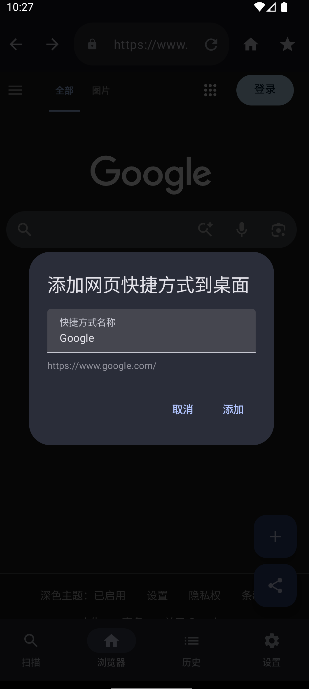
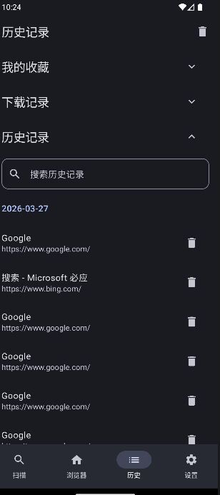
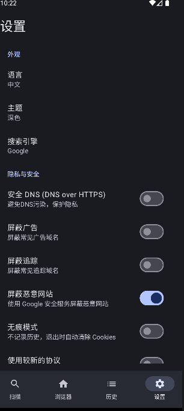

# SyncBrow

[English](#english) | [简体中文](#简体中文)

---

## English

SyncBrow is a powerful, privacy-focused Android application that combines a fast QR code scanner with a secure, feature-rich web browser. Built using modern technologies like Jetpack Compose and Material 3, it offers a premium, localized user experience.

### 📸 Screenshots

  
  
  

### ✨ Key Features

*   **⚡ Smart QR Scanner**: Instantly scan and parse QR codes with automatic redirection for valid URLs.
*   **🛡️ Advanced Privacy & Security**:
    *   **Incognito Mode**: Browse without saving history or cookies.
    *   **Ad & Tracker Blocker**: Built-in filtering for many common ad and tracking domains.
    *   **Safe Browsing**: Proactively blocks access to known malicious websites.
    *   **Secure DNS (DoH)**: Supports DNS over HTTPS to prevent DNS spoofing and protect your privacy.
*   **🚀 Enhanced Web Experience**:
    *   **Add-on System**: Support for user scripts like "Force Copy/Paste" and "Remove Redirect Prompts".
    *   **Download Manager**: Robust download management with system integration and file path tracking.
    *   **Desktop Shortcuts**: Pin your favorite webpages directly to your Android home screen.
*   **🎨 Premium UI/UX**:
    *   **Material You**: Dynamic themes and Material 3 design for a modern look and feel.
    *   **Customizable Search**: Choose between Google, Bing, and Yahoo for your default search engine.
    *   **Multi-language Support**: Fully localized in English and Chinese.

### 🛠️ Tech Stack

*   **Language**: Kotlin
*   **UI Framework**: Jetpack Compose
*   **Web Core**: Android WebView
*   **Database**: Room (for History and Bookmarks)
*   **Networking**: OkHttp & OkHttp DoH
*   **Icons**: Material Icons

---

## 简体中文

SyncBrow 是一款功能强大、注重隐私的 Android 应用，结合二维码扫描器与安全的轻量网页浏览器，基于 Jetpack Compose 和 Material 3 构建。

### 📸 演示截图

  
  
  

### ✨ 核心功能

*   **⚡ 二维码扫描**: 扫描并解析二维码，支持对有效网址的自动跳转，避免使用不安全的中国App扫描。
*   **🛡️ 隐私与安全**:
    *   **无痕模式**: 浏览不留下历史记录或 Cookie。
    *   **广告与追踪屏蔽**: 内置过滤功能，拦截常见广告及追踪域名。
    *   **安全浏览**: 利用Google Safe Browser，自动屏蔽已知的恶意网站。
    *   **安全 DNS (DoH)**: 支持通过 HTTPS 进行 DNS 查询，防止 DNS 劫持并保护隐私。
*   **🚀 增强网页体验**:
    *   **插件系统**: 支持用户脚本。
    *   **下载管理**: 下载管理系统，支持与系统文件管理器集成及路径跟踪。
    *   **桌面快捷方式**: 将您喜爱的网页直接固定到 Android 桌面首页。
*   **🎨 高级 UI/UX**:
    *   **Material You**: 采用 Material 3 设计方案，支持动态主题，界面现代美观。
    *   **个性化搜索**: 可选 Google、Bing 或 Yahoo 作为默认搜索引擎。
    *   **多语言支持**: 完整支持中英文双语切换。

### 🛠️ 技术栈

*   **编程语言**: Kotlin
*   **UI 框架**: Jetpack Compose
*   **网页核心**: Android WebView
*   **数据库**: Room (用于存储历史记录和书签)
*   **网络库**: OkHttp & OkHttp DoH
*   **图标**: Material Icons
